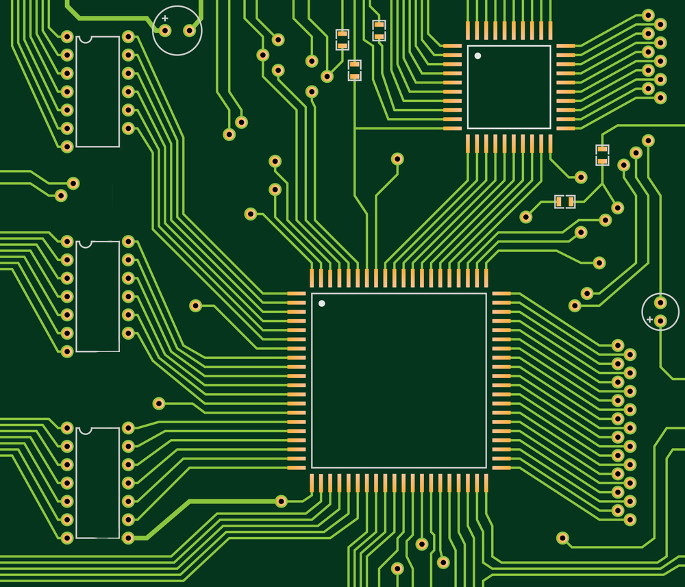
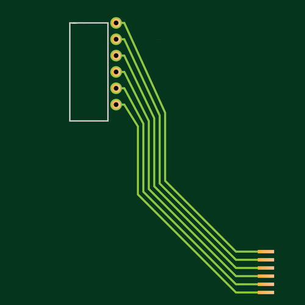

# Image2schematic - Fetching via HTTP branch

[](https://makeapullrequest.com) 

### **Image2schematic** is a Python project that aims to provide a reliable tool for everyone to extract PCB schematics from images using Computer Vision and Neural networks. Any help is greatly appreciated!

We use [OpenCV](https://opencv.org/) for image detection and modification and [skidl](https://github.com/devbisme/skidl) for building out a schematic. In addition, [PCB-CD](https://github.com/s39674/PCB-Component-Detection) is used to classify pcb components and [EasyOCR](https://github.com/JaidedAI/EasyOCR/) to read text on chips.

**Global SITREP**: Got EasyOCR working to some degree; The dedicated branch has been merged.

---------------------------------------------------

There are multiple stages needed for this project:

1. First things first, the raw image needs to be modified so that traces between components could be better analysed. Something like this is much much better than raw:

    <p align="left"></p>

2. Using `OpenCV` and `PCB-CD`, we need to identify pcb components such as resistors, capacitors, Integrated Circuits etc. For example: (This is the back of a Raspberry Pi 3B)

    <p align="left"></p>

    And for each detected component we run it through PCB-CD:

    

    ```Prediction Output: capacitor```

3. For every chip that got detected, using `OpenCV` and  `EasyOCR`, we need to extract the text on those ICs, and then pass that into `skidl` `search()` function to get the pinout of the Integrated Circuit, as well as the schematic symbol.

4. Using `OpenCV`, we will now analyze the pin to pin traces that connect between components.

5. Using all this data metioned above, and using `skidl`, we will craft a file with skidl's syntax describing the circut, and then output a schematic using `skidl_to_schematic` tool.

    **SITREP**: `skidl_to_schematic` is currently not working.


## Testing

**Note**: 

`skidl` does require some part libraries from `KiCAD`. IF you don't want to install `KiCAD` you can just install the part libraries from: https://gitlab.com/kicad/libraries/kicad-symbols then point the environment variable to it:
```bash
$ git clone https://gitlab.com/kicad/libraries/kicad-symbols
# for windows:
$ setx KICAD KICAD_SYMBOL_DIR="/path/to/kicad/symbols/"
# for linux:
$ export KICAD_SYMBOL_DIR="/path/to/kicad/symbols/"

$ pip install skidl
```

To test IC text detection, you need to install `EasyOCR`: https://github.com/JaidedAI/EasyOCR/

EasyOCR, as far as i can tell, only works with `opencv=<4.5.4.60`:

```bash
$ pip install easyocr
# easyocr unnecessary install this package which interfere with opencv-python:
$ pip uninstall opencv-python-headless
# IF you have another opencv package, uninstall it and then:
$ pip install opencv-python==4.5.4.60
```

For testing pcb components detection, please refer to [PCB-CD](https://github.com/s39674/PCB-Component-Detection) repo.

After you cloned the repository, <ins>first run</ins> `detectingPoints.py`:

```bash
$ python3 detectingPoints.py
```

Now you should have `PointsFileFor_Board8.png.txt` file under `output/Files`. This file should include all the coordinates (x,y) of the board electrical points.

Currently there are only a few examples, located at: `assets/Example_images/Board_images/`, but feel free to try it on other board images and post your result in the `Discussions` tab.

<p align="left"></p>

After that, run `ConnectionFinding.py`:

```bash
$ python3 ConnectionFinding.py
```

If you now look at `PointsFileFor_Board8.png.txt` you should now see every connection from any point: 

```txt
Point: [435,479]                                                           =>  connected to: (190,171)
Point: [435,466]                                                           =>  connected to: (190,144)
Point: [435,453]                                                           =>  connected to: (190,117)
Point: [435,439]                                                           =>  connected to: (190,90)
Point: [435,426]                                                           =>  connected to: (190,64)
Point: [436,412]                                                           =>  connected to: (190,37)
ATtiny841-SS | 6/PA7,p6,PA7/BIDIRECTIONAL | [190,171]                      =>  connected to: (435,479)
ATtiny841-SS | 5/PB2,PB2,p5/BIDIRECTIONAL | [190,144]                      =>  connected to: (435,466)
ATtiny841-SS | 4/~{RESET}/PB3,~{RESET}/PB3,p4/BIDIRECTIONAL | [190,117]    =>  connected to: (435,453)
ATtiny841-SS | 3/XTAL2/PB1,XTAL2/PB1,p3/BIDIRECTIONAL | [190,90]           =>  connected to: (435,439)
ATtiny841-SS | 2/XTAL1/PB0,XTAL1/PB0,p2/BIDIRECTIONAL | [190,64]           =>  connected to: (435,426)
ATtiny841-SS | 1/VCC,p1,VCC/POWER-IN | [190,37]                            =>  connected to: (436,412)
```

What we can see are the x,y coordinates of the points, and the x,y coordinates of what point is connected to it. At the bottom we can see what IC is connected to those points and some information about them. (In this example the IC name was hard-coded, IC detection example isn't ready yet)

This is the baseline to building an entire schematic.

If you encountered any issues during installation or testing of `Image2schematic`, OR if you have any suggestions, please feel free to post them in the issues tab.

## Few topics i need help with:

- Component classification needs to be fine tuned to get better results. It should also output confidence percentage. Please see [PCB-CD](https://github.com/s39674/PCB-Component-Detection) for more info.
- More than 2 point connection finding - right now we can't detect lines that connect 3 different components at once.
- Skidl_to_schematic algorithm - I can't get the algorithm that takes skidl code and output a schematic to work.

I want to thank you for reading this and i hope you can help me, thank you!
